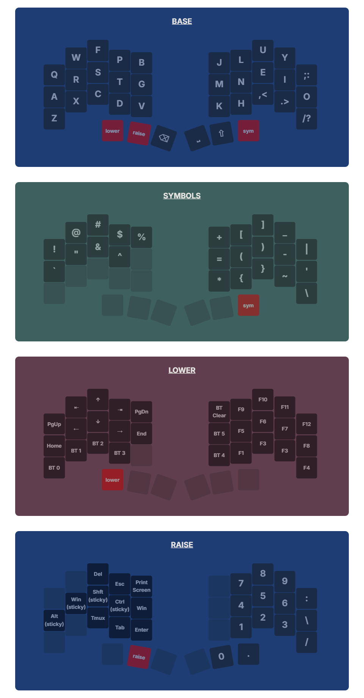

ZMK config for Chocofi keyboard from [Beekeeb](https://shop.beekeeb.com/product/chocofi-36-keys-kailh-low-profile-choc-v1-mechanical-ergonomic-hotswap-split-keyboard-diy-kit/)

Visual keymap created using [Keyfab](https://jaroslaw-weber.github.io/keyfab/)
